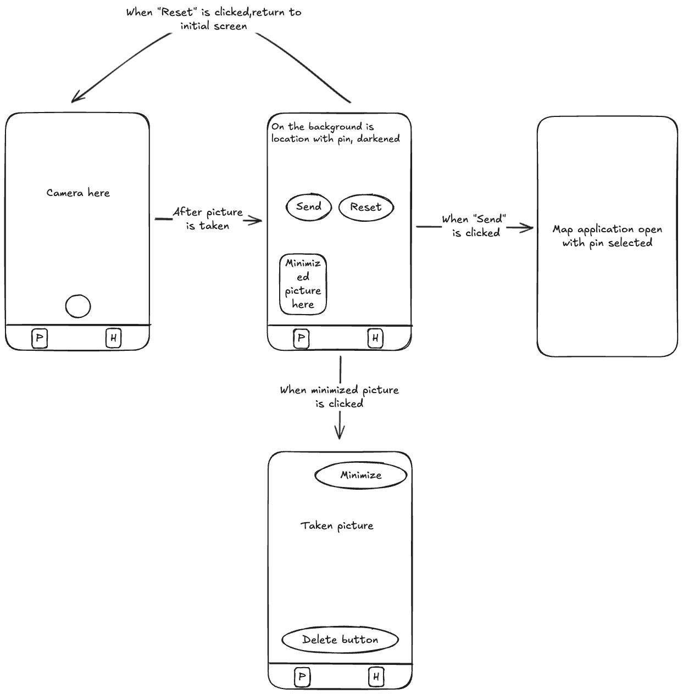
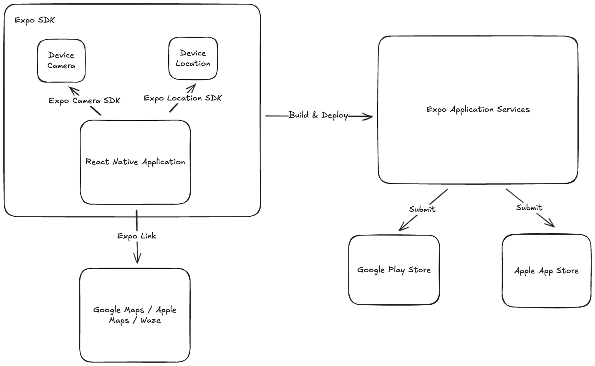

# Park and Snap

## Цел на проекта

Колко често сте забравяли автомобилите си след паркиране и колко бихте се радвали да ги намирате лесно и бързо. Park & Snap решава този проблем чрез интуитивно и ефективно мобилно приложение.

С помощта на мобилните устройства, камерата и GPS координатите, записани при снимката, приложението дава лесен интерфейс за локализиране на автомобила. Интеграцията с Maps базирани приложения позволява използването на изпращане на локацията и отваряне на вече имплементирани функции за навигация до дестинацията на автомобила.

Основните предимства на приложението са:

- Простота на използване - само един клик за запазване на локация
- Интуитивен интерфейс без излишни функции
- Бърз достъп до последно запазената локация
- Интеграция с други навигационни приложения

За мобилното приложение са използвани **React Native** и платформата **Expo**. Този технологичен избор позволява създаването на приложение за Android и iOS от една кодова база, като същевременно се улеснява достъпът до native функционалности и се оптимизира процесът на разработка и дистрибуция. Повече детайли за избраните технологии са описани в съответната секция.

### Wireframe

### Задачи

| Задача | Описание                                                | Статус   |
| ------ | ------------------------------------------------------- | -------- |
| 1      | Изграждане на wireframe на приложението                 | Готово   |
| 2      | Създаване на Expo проект                                | Готово   |
| 3      | Добавяне на права и библиотеки за локация и камера      | Готово   |
| 4      | Екран 1: Камера за снимка                               | Готово   |
| 5      | Екран 2: Локация с бутони "Send" и "Reset"              | В процес |
| 6      | Функционалност "Send" - отваряне на приложение за карти | Предстои |
| 7      | Функционалност "Reset" - връщане към начален екран      | Предстои |
| 8      | Миниатюра на снимката в ъгъла                           | Предстои |
| 9      | Екран 3: Уголемен преглед на снимката                   | Предстои |
| 10     | Функционалност "Delete" за изтриване на снимката        | Предстои |
| 11     | Функционалност "Minimize" за смаляване на снимката      | Предстои |
| 12     | Интеграция с външно приложение за карти                 | Предстои |

## Архитектура

Архитектурата на приложението е изградена около екосистемата на Expo, която осигурява инструменти за всички етапи – от разработката до дистрибуцията. Диаграмата по-долу илюстрира основните компоненти и потока на взаимодействие между тях.

### Основни компоненти

1.  **React Native Application**: Ядрото на приложението, написано на TypeScript. Тук е имплементирана цялата бизнес логика и потребителски интерфейс.

2.  **Expo SDK**: Набор от библиотеки, които осигуряват достъп до нативни функционалности. Ключови за проекта са:

    - **Expo Camera SDK**: Осигурява интерфейс за работа с камерата на устройството.
    - **Expo Location SDK**: Предоставя достъп до GPS данните.
    - **Expo Link (`expo-linking`)**: Позволява интеграция с други апликации (като тези за карти) чрез отваряне на външни връзки.

3.  **Външни навигационни приложения**: Чрез `expo-linking` приложението препраща потребителя към външни картови услуги като Google Maps, Apple Maps или Waze за навигация.

4.  **Expo Application Services (EAS)**: Облачната платформа на Expo, използвана за:

    - **Build & Deploy**: Компилиране на кода в нативни пакети (`.apk`/`.ipa`) и управление на обновления "по въздуха" (Over-the-Air updates).

5.  **App Stores**: Финалните пакети се изпращат (**Submit**) към **Google Play Store** и **Apple App Store** за дистрибуция до крайните потребители.

### Технологии

За разработката на "Park & Snap" са използвани съвременни и доказани технологии, които осигуряват бързина, надеждност и лесна поддръжка. Изборът на всяка технология е направен с цел оптимизация на процеса на разработка и постигане на висококачествен краен продукт.

- **React Native**

  - **Описание**: JavaScript рамка за създаване на нативни мобилни приложения за iOS и Android от една и съща кодова база.
  - **Причина за избор**: Позволява значително да се намали времето и ресурсите за разработка, като се поддържат и двете платформи едновременно, без компромис с потребителското изживяване.
  - **Документация**: [https://reactnative.dev/](https://reactnative.dev/)

- **Expo**

  - **Описание**: Платформа и набор от инструменти, изградени върху React Native, които улесняват разработката, компилирането и разпространението на мобилни приложения.
  - **Причина за избор**: Expo предоставя "managed" работен процес, който абстрахира голяма част от сложността при работа с нативен код. Включва богата библиотека от SDK-та (като `expo-camera`, `expo-location`), облачни услуги за компилиране (EAS Build) и лесен процес за публикуване в App Store и Google Play.
  - **Документация**: [https://docs.expo.dev/](https://docs.expo.dev/)

- **TypeScript**

  - **Описание**: Надграждане на JavaScript, което добавя статична типизация.
  - **Причина за избор**: Използването на TypeScript помага за ранното откриване на грешки по време на разработка, подобрява четимостта на кода и улеснява поддръжката и рефакторирането в дългосрочен план.
  - **Документация**: [https://www.typescriptlang.org/](https://www.typescriptlang.org/)

<!-- - **Excalidraw**
  - **Описание**: Инструмент за създаване на диаграми със стил, наподобяващ ръчно рисувани скици.
  - **Причина за избор**: Избран е за създаване на архитектурната диаграма поради своята простота и възможността за лесно вграждане и съхранение на диаграмите като код в проекта.
  - **Документация**: [https://excalidraw.com/](https://excalidraw.com/) -->

## Екрани

Тук са представени основните екрани на приложението, които съответстват на потребителските сценарии, описани в секция "Задачи".

### 1. Начален екран (Камера)

Това е първият екран, който потребителят вижда. Той предоставя достъп до камерата за заснемане на снимка на паркирания автомобил. В момента на снимката се записват и GPS координатите.

_Забележка: Тук можете да поставите екранна снимка на камерата, например в `docs/screenshots/screen1-camera.png`_

### 2. Екран за преглед (Карта и бутони)

След като снимката е направена, приложението показва този екран. На него се вижда карта с маркирано местоположение, миниатюра на снимката и два бутона:

- **Send**: Отваря външно приложение за навигация.
- **Reset**: Изтрива данните и връща към началния екран.

_Забележка: Тук можете да поставите екранна снимка на картата с бутоните, например в `docs/screenshots/screen2-preview.png`_

### 3. Преглед на снимката

При натискане на миниатюрата от втория екран се отваря модален прозорец с уголемен размер на снимката. Това позволява на потребителя да види по-добре детайли, които биха му помогнали да намери автомобила си.

_Забележка: Тук можете да поставите екранна снимка на уголемената снимка, например в `docs/screenshots/screen3-image-modal.png`_
